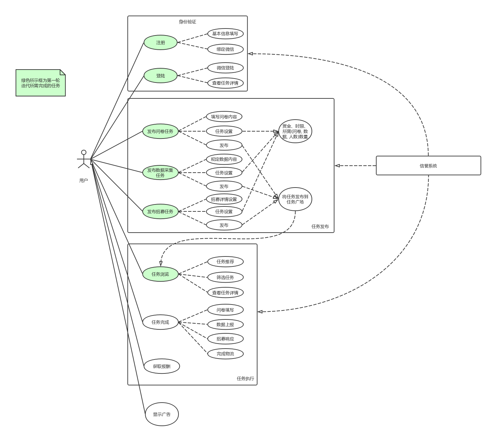

# 用例

| 版本 |   日期    | 描述 |  作者   |
| :--: | :-------: | :--: | :-----: |
| v1.0 | 2019-4-22 | 基本用例完成 | Young |
| v1.1 | 2019-5-1 | 完善用例 | Young |
{:.no_toc}

* 目录
{:toc}

----

## 用例图

## 用例
整个系统按照业务划分为下面几个用例，这里只显示摘要，点击用例可以跳转至相应页面查看用例的详细叙述以及用例的活动图。

### 基本用例
- [注册登录](register_login.md)：进行用户的注册和登录，如果已经绑定微信的用户可以打开微信小程序后自动登录。
- [修改用户资料](modify_user.md)：用户可以完善个人的信息
- [发布任务](create_task.md)：用户需要填写任务名称、联系方式、过期时间、需求数量、报酬，选择任务类型（问卷、收集信息、招募）并根据类型填写具体的任务内容，发布任务并预支付任务酬金。
- [管理任务]()：发布者在任务管理界面，进行修改任务、终止任务。修改任务：对任务的描述信息、需求数量等信息进行修改，需求数量不能低于已完成数量。终止任务：发布者对终止任务，退回未使用的酬金。
- [验证任务]()：发布者在任务结果页面，对任务的完成情况进行验证，不符合要求的任务可以进行拒绝验收，符合要求的确认任务完成。
- [浏览任务]()：用户在任务广场浏览任务的简要信息，可进行筛选和排序。
- [查看任务]()：用户查看任务详细介绍，并且在该页面选择接受任务。
- [执行任务]()：用户接下任务后，按照任务的详细要求以及相关指引完成任务。可在该界面取消任务。

### 拓展用例
- 分析问卷：发布者查看问卷的结果，可以对文件的结果进行分析
- 用户评价：任务发布者对任务完成者的完成情况进行评价，任务接受者对用户发布者的任务质量进行评价。
- 数据导出：导出问卷数据、收集的信息数据、招募者信息。
- 广告
