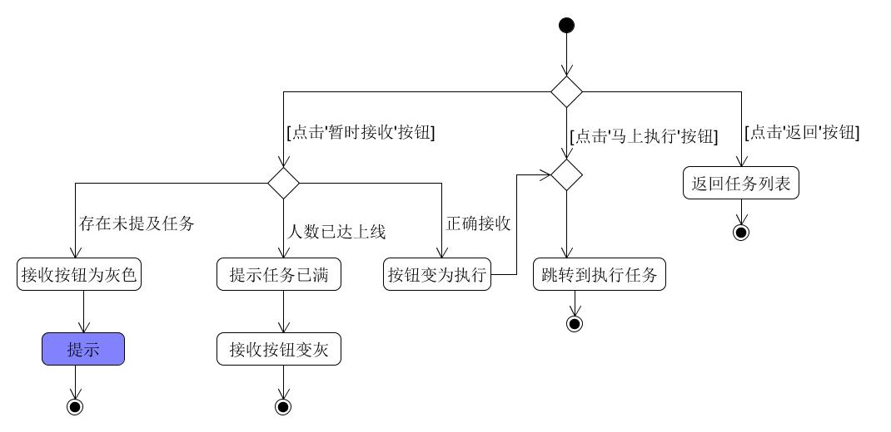

# 用例：接受任务

| 版本 |   日期    | 描述 |  作者   |
| :--: | :-------: | :--: | :-----: |
| v1.0 | 2019-5-5 | 详细用例 | Young |
| v2.0 | 2019-6-4 | 根据不同status改变按钮的显示 | Young |

---
## 用例1：浏览任务
#### 用例文本
**用例：** 浏览任务

**参与者：** 用户

**主成功场景：**
1. 浏览列表中任务的简要信息，包括任务名称、任务简述（问卷和信息收集显示任务简述，招募显示时间、地点），任务报酬，任务类型
2. 筛选任务类型，筛选某些特定受众的任务，只显示这些任务
3. 对任务进行排序，根据薪酬、时间（只有招募任务）进行排序
4. 点击某个任务，可进入任务详情界面

**替代场景：**

**发生频率：** 经常

**未决问题：**
1. 按哪些内容进行筛选
2. 根据哪些内容进行排序

#### 活动图

---
## 用例2：查看任务详情

#### 用例文本详情
**用例：** 查看任务

**范围：** 包包赚用户客户端

**级别：** 用户目标

**主要参与者：** 任务接受者

**涉及其关注点：**

- 任务接受者：了解任务的详细信息，接受任务

**前置条件：**
在任务列表中点击该任务

**后置条件：**
接受任务或者退出该页面

**主成功场景：**
1. 查看任务的信息，包括如下内容：
   1. 任务名称、任务简述
   2. 具体任务内容：
    - 问卷：问卷描述
    - 信息收集：信息要求
    - 招募：招募要求、时间、地点、需要提交的信息
   3. 联系方式、受众类型要求、需求数量、已提交数量、个人报酬
2. 选择接取任务，则跳转到任务执行界面
3. 选择返回，则返回任务广场

**拓展：**
*.a 如果任务已经被审核（包括达标或者不达标的情况）
    需要显示feedback内容

2.a 接受任务时，后台返回接受数已满
   1. 提示，“任务可接受数量已满”
   2. 无法接取任务，并将“接受任务”的按钮标灰锁定

2.b 有未提交的任务的同类型任务
   1. 提示，“存在未提交的xx类型任务，请先完成”
   2. 无法接取任务

2.c 已经接取了任务
   1. "接取任务"的按钮变为"执行任务"之类的按钮

2.d 任务不达标
   1. 完成任务的按钮变为“修改”
   2. 点击后可对重新进入执行页面

**特殊需求：**

**技术与数据变元表：**

**发生频率：** 经常

**未决问题：** 

#### 活动图

