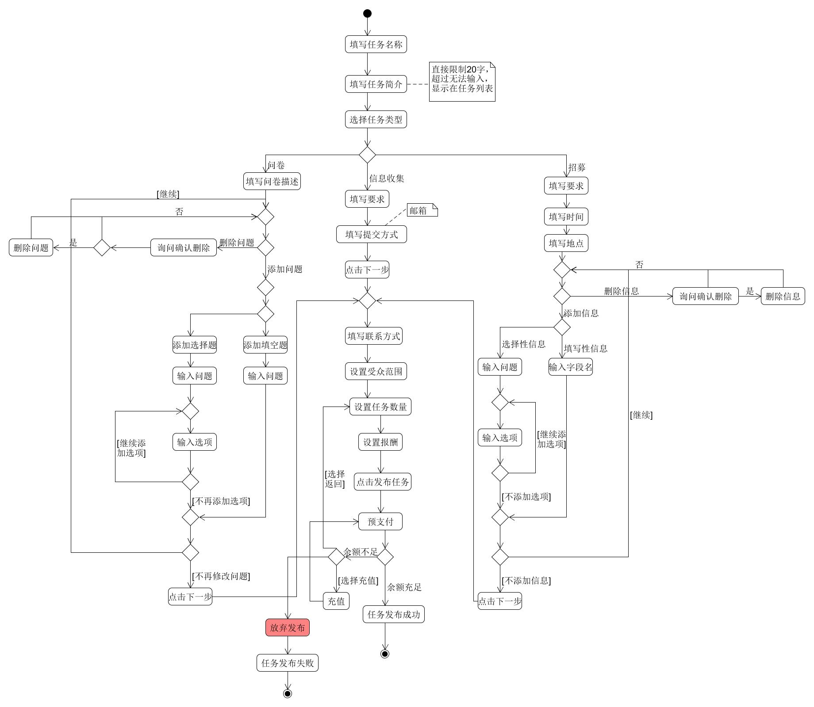

# 用例：发布任务

| 版本 |   日期    | 描述 |  作者   |
| :--: | :-------: | :--: | :-----: |
| v1.0 | 2019-5-3 | 详细用例 | Young |

---
## 用例文本
**用例：** 发布任务

**范围：** 包包赚用户客户端

**级别：** 用户目标

**主要参与者：** 任务发布者

**涉及其关注点：**

- 任务发布者：发布者希望发布新的任务，选择一个任务类型并填写相应的任务内容要求

**前置条件：**
任务发布者已经成功注册了账户

**后置条件：**
任务发布者成功发布了任务

**主成功场景：**

1. 填写任务名称、任务简述（限制20字）
2. 选择任务类型(问卷、信息收集、招募)，并填写相关内容
   1. 问卷：问卷描述、问题设置以及选项设置
   2. 信息收集：信息要求、提交方式(目前只能用邮箱，需要输入接收邮箱)
   3. 招募：招募要求、时间、地点、需要提交的信息（自定义）
3. 填写联系方式、受众类型要求、需求数量、个人报酬
4. 点击发布任务
5. 预支付任务的总报酬

**拓展：**

*a. 任意时刻发生网络请求失败  
保存好用户已经输入完成的内容。
  1. 询问失败是否重试
  2. 修复网络问题，网络恢复
  3. 系统重建当时的操作场景

2.1.a 增加问卷题目
   1. 选择题目类型
   2. 填空题：输入题目
   3. 选择题：选择单选题还是多选题、输入题目以及选项
   4. 量表矩阵（目前先不做）：输入题目，批量输入量表级别(例如：非常满意、满意、一般、不满意、非常不满意)，批量输入题目

2.1.b 删除问卷题目
   1. 提示是否确认删除
   2. 如果确认则删除问题

5.a 用户的账户的余额不足
   1. 提示余额不足无法发布任务
   2. 询问是否跳转到充值页面进行充值，充值结束后返回该页面
   3. 修改任务的需求数量和个人报酬

**特殊需求：**

1. 在小程序端需要注意场景之间页面跳转，哪些场景可以放在一个页面，哪些需要进入到下一页。
2. 任务的内容可以用json存储

**技术与数据变元表：**

**发生频率：** 较多

**未决问题：**

## 活动图

