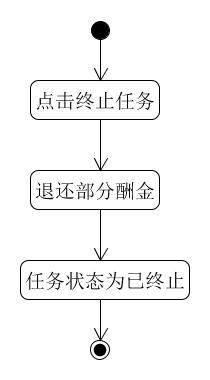

# 用例：管理任务

| 版本 |   日期    | 描述 |  作者   |
| :--: | :-------: | :--: | :-----: |
| v1.0 | 2019-5-4 | 详细用例 | Young |

---

## 用例1：终止任务
#### 用例文本
**用例：** 终止任务
**参与者：** 任务发布者

**目的：** 发布者不想要继续发布这项任务，或者想提前结束该任务

**主成功场景：**
1. 任务发布者点击终止任务
2. 系统根据未完成数量返还预付款。
3. 任务记录中该任务为已终止

**代替场景：**

#### 活动图

---
## 用例2：验证任务
#### 用例文本
**用例：** 验证任务

**范围：** 包包赚用户客户端

**级别：** 用户目标

**主要参与者：** 任务发布者

**涉及其关注点：**

- 任务发布者：查看任务接受者的完成情况，并判定任务是否成功完成，给予酬金

**前置条件：**
任务成功发布，有发布者提交了任务。

**后置条件：**
成功判断任务接受者是否完成了任务。

**主成功场景：**
1. 点击进入该任务的提交列表，查看已经提交的任务记录（包括不达标的任务）
2. 点击某个已提交的任务记录，查看内容。
3. 根据填写的内容进行验证，并写评价，如果达标，则选择任务完成，任务状态改为已完成。
4. 如果任务不达标，则选择不达标，任务状态改为不达标。

**拓展：**
3.a 批量签收
   1. 提供多选、全选、全不选，来选择提交记录
   2. 对选中的任务提交设置为已完成。

4.a 任务多次不达标(暂时不做)
   1. 不达标次数达到3次，则提示，禁止恶意拒绝签收任务。
   2. 不达标次数达到6次，则将该任务送入后台管理员进行仲裁。

**特殊需求：**
任务的状态分为未完成、待审核、已完成、不合格。

**技术与数据变元表：**

**发生频率：** 经常

**未决问题：**
如何避免发布者恶意将提交的任务标为不达标。

#### 活动图

